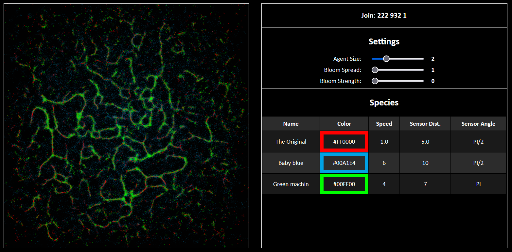
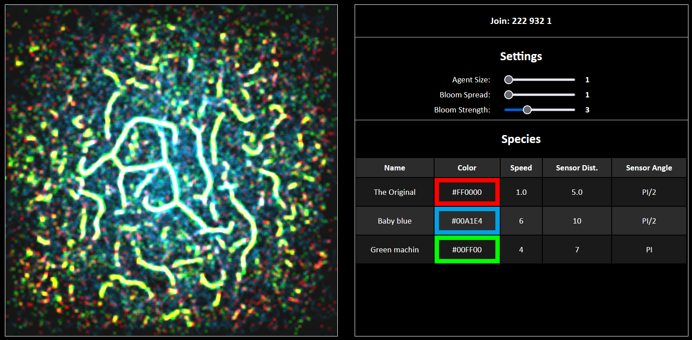
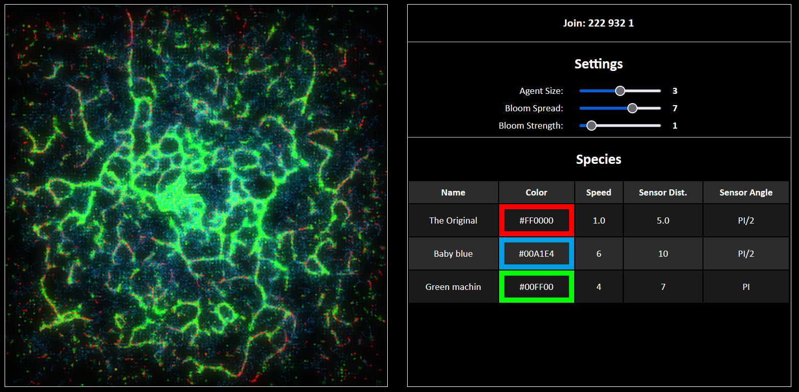
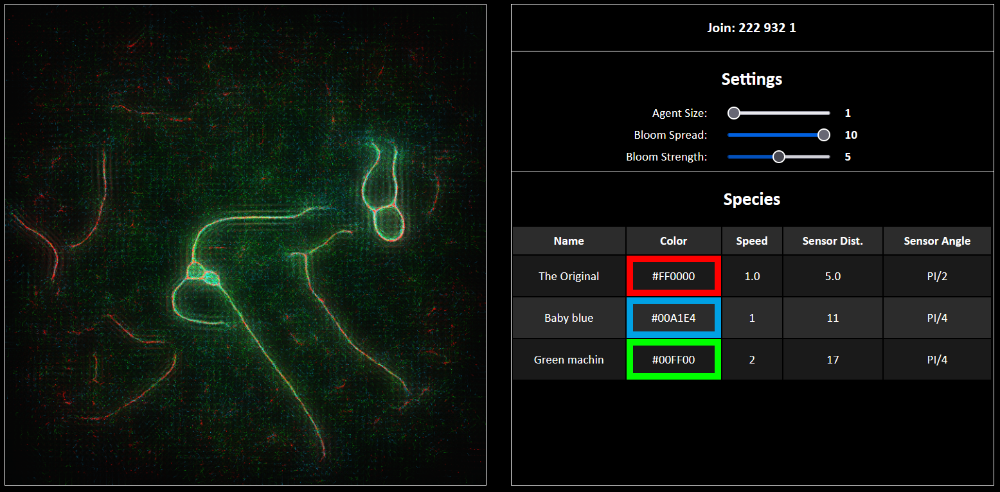

# "Physarum Together" #

(Try it yourself: [Run instructions](https://github.com/m-d-jo/cs-420x-demos/tree/main/final/run-instructions.md))

## Implementation notes ##

For the final project, I wanted to extend [my physarum simulation](https://m-d-jo-a4-physarum.netlify.app/) by using input from multiple users at once.  It's entertaining to interact with the simulation alone, and using one set of parameters for all agents - but I was curious to see how different "species" of agents (different speeds, sensor angles, etc.), each controlled by different users, would interact on screen.

To get input from multiple users, I decided to integrate [AirConsole](https://developers.airconsole.com/): a JavaScript-based platform for games that use mobile devices as controllers.  Visuals on all devices (the computer/TV running the game, and all the connected "controller" mobile devices) are served from HTML files, which made it very easy to connect the existing simulation to the AirConsole setup.

Before adding AirConsole support, though, I needed to reconfigure the physarum simulation to work with multiple "species".  Rather than creating a new buffer for each species, I opted instead to create a large number of agents (60,000) on startup and assign some portion of them to one user (10,000 for each).  This change also meant that agent properties (e.g. speed) would need to change more than once per draw call, so I had to convert them from simple uniform attributes to buffered data.  Lastly, when a user has disconnected, their agents become inactive and disappear from the simulation.  This took quite a lot of adjusting (and staring at many flushed-out, blurry, or blank screens) to get right, but I was ultimately able to get these separations working and could correctly draw agents with 6 unique sets of parameters.

Integrating AirConsole with the simulation was fairly straightforward, mostly making use of its "messaging" system between devices.  I made a simple HTML form interface for the mobile devices, where users can set their species' name, color, and other parameters; when the form is updated, that device sends a message instructing the main device to update the changed parameter, which gets used in the next draw call.

Lastly, I added some more polish to the appearance and layout of the simulation.  First was a table of all active species and their parameters, so observers could compare them to one another and understand the movements of each color.  Then I added a bloom effect (essentially a more extreme blur) with some on-screen controls, to add visual interest to the simulation.

## Screenshots ##

Examples of different bloom settings:

## Video ##

Click to watch:

[
